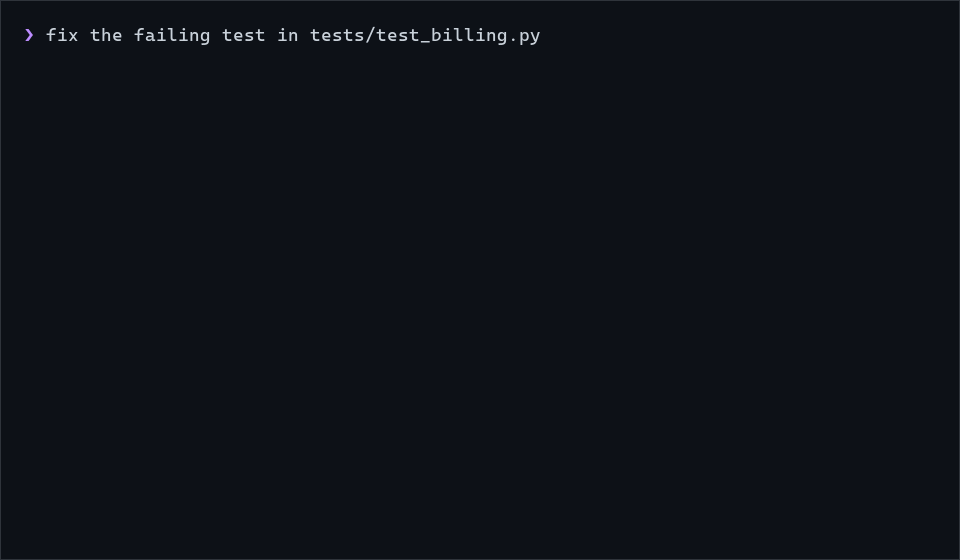

<h1 align="center">cc-oracle</h1>

<p align="center">
  <strong>A Claude Code plugin that stops your session from flailing.</strong><br>
  The moment a session is unsure or stuck, it consults a read-only, best-model oracle and implements the plan it gets back.
</p>

<p align="center">
  <a href="https://github.com/exPardus/cc-oracle/releases"></a>
  <a href="LICENSE"></a>
  
  
</p>

```
/plugin marketplace add exPardus/cc-oracle
/plugin install oracle@cc-oracle
```

That is the whole setup. Nothing to configure, nothing to run, no Python or Node required.

<p align="center">
  
</p>
<p align="center"><sub>Illustrative session. The hook and nudge text are what the plugin actually emits.</sub></p>

## Why

Every agentic coding session hits a wall sometimes: a test that will not pass, an error it cannot place, a fix that keeps almost working. Left alone, a model keeps trying. Each attempt adds noise to its own context, and the tenth attempt is being made by a model that is now reasoning over nine failures. Tokens burn, and the code gets worse.

cc-oracle changes the default. When a session notices it is unsure, it stops and sends a structured brief to the **oracle**: a fresh-context subagent on the best available model, restricted to read-only tools. The oracle reads the actual code, diagnoses the root cause, and hands back a numbered plan. The original session implements it.

This makes a cheap main model plus an on-demand expensive consultant a workable setup. Run your day-to-day session on a smaller model and pay for the best one only at the moments that need it. Strong models benefit too: a second opinion from a context that has not been polluted by the dead ends.

## Install

**Requirement:** Claude Code with plugin support. Type `/plugin` in a session; if it is not recognized, [update Claude Code](https://code.claude.com/docs/en/setup) first.

### 1. Add the marketplace

Inside a Claude Code session:

```
/plugin marketplace add exPardus/cc-oracle
```

This registers this repository as a plugin catalog. Nothing is installed yet.

### 2. Install the plugin

```
/plugin install oracle@cc-oracle
```

Claude Code opens the plugin's details and asks for a scope:

| Scope | Effect |
|---|---|
| **User** (recommended) | Active in every project on this machine, just for you |
| **Project** | Active for everyone who opens this repository; written to `.claude/settings.json` |
| **Local** | Active for you in this repository only |

The install summary ends with either `Plugin is now active.` or `Run /reload-plugins to activate.` Do what it says.

### 3. Check it took

```
/plugin list
```

`oracle@cc-oracle` should be listed and enabled. In a new session, typing `@oracle:oracle` should autocomplete the agent.

### Other ways to install

**From a shell, without opening a session** (installs to user scope unless you pass `--scope user|project|local`; the plugin loads at the next launch):

```sh
claude plugin marketplace add exPardus/cc-oracle
claude plugin install oracle@cc-oracle
```

**For a whole team**, commit this to the project's `.claude/settings.json`. Claude Code registers the marketplace for anyone who trusts the folder and tells them the exact `claude plugin install` command to run to fetch the plugin:

```json
{
  "extraKnownMarketplaces": {
    "cc-oracle": {
      "source": { "source": "github", "repo": "exPardus/cc-oracle" }
    }
  },
  "enabledPlugins": {
    "oracle@cc-oracle": true
  }
}
```

**From a local clone**, for hacking on the plugin itself:

```sh
git clone https://github.com/exPardus/cc-oracle.git
claude --plugin-dir ./cc-oracle
```

### Update, disable, remove

Third-party marketplaces do not auto-update by default. To pick up a new release:

```
/plugin marketplace update cc-oracle
/reload-plugins
```

To switch it on or off without uninstalling:

```
/plugin disable oracle@cc-oracle
/plugin enable oracle@cc-oracle
```

To remove it entirely:

```
/plugin uninstall oracle@cc-oracle
```

You can also enable auto-update for this marketplace from `/plugin` → **Marketplaces** → **cc-oracle**.

## What you get

Four pieces, all active the moment the plugin is enabled.

**1. Doctrine.** A `SessionStart` hook injects a short standing instruction into every session. This is the text, verbatim:

> Uncertainty is a signal, not a failure. The moment you notice you are unsure, stuck, confused, or going in circles: do NOT keep attempting solo and pollute your context — dispatch the `oracle` agent first, then implement its plan yourself.
>
> When summoning the oracle, ALWAYS send a full brief: Goal (what the task ultimately wants), Problem (the exact blocker, errors quoted verbatim), Tried (attempts made + why each failed), Context (relevant files/paths, versions, platform, project rules), Question (the specific ask, not "help"). The oracle shares none of your context — a thin brief wastes the consult and forces a second round-trip.
>
> If the dispatch errors for any reason, retry the same Agent call once with model "opus".
>
> This applies at every tier: strong models may consult the oracle for a fresh-context second opinion.

**2. The oracle agent.** [`agents/oracle.md`](agents/oracle.md) defines a subagent that runs on the `fable` model alias with `Read`, `Grep`, and `Glob` only. No `Bash`, no `Edit`, no `Write`: it cannot change anything, so a consult is always safe. It verifies the brief against the code itself rather than trusting the caller's account, and answers in a fixed shape: **Diagnosis** with file:line evidence, a numbered **Plan**, and any real **Pitfalls**.

**3. A safety net for forgetting.** A `Stop` hook checks the final message of each turn. If the model said something like `"I'm not sure"`, `"I'm stuck"`, or `"can't figure out"` and did not consult the oracle that turn, the turn is blocked once with a nudge that quotes the model's own words:

```
You stated uncertainty this turn without consulting the oracle: "I'm not sure why the test still fails". Dispatch the `oracle` agent now with a full brief — Goal, Problem (errors verbatim), Tried (attempts + why each failed), Context (files/constraints), Question (specific ask) — then implement its plan.
```

The check is deliberately conservative. It ignores questions addressed to you, anything inside code fences, blockquotes, inline code, or double quotes, and anything already covered by a consult. It fires at most once per turn and fails open on any parse error: a hook must never wedge a session.

**4. A trigger for silent stalling.** A model that never admits it is stuck still leaves a trail: tool calls that keep failing. Three consecutive failing tool calls in one turn earn the same nudge. Read-only lookups (`Read`, `Glob`, `Grep`, `LS`) do not count, since a run of those failing is a model hunting for a file, and any successful call resets the count. The threshold came from measuring 1,741 real turns; see [`docs/development.md`](docs/development.md) for the numbers.

## What a consult looks like

The main session dispatches the oracle with a brief like this:

```
Goal: make `pytest tests/test_billing.py` pass after the invoice refactor.
Problem: test_prorate_mid_month fails with
  AssertionError: assert Decimal('12.90') == Decimal('12.91')
Tried: rounding at the end (still off by one cent), rounding each line
  item (breaks two other tests), ROUND_HALF_EVEN instead of ROUND_HALF_UP
  (no change).
Context: billing/prorate.py, billing/invoice.py; Python 3.12; repo rule:
  money is always Decimal, never float.
Question: where is the cent being lost, and which rounding point is correct
  for all three tests?
```

And the oracle answers in its fixed shape:

```
**Diagnosis** — `prorate.py:41` divides by `days_in_month` as an int, which
Python promotes to Decimal fine, but `days_used` on line 38 comes from
`(end - start).days / 30` — a float — so the ratio is a float before it ever
meets a Decimal. The cent is lost there, not at rounding.

**Plan**
1. `prorate.py:38`: build the ratio as `Decimal(days_used) / Decimal(days_in_month)`.
2. Remove the per-line rounding added in the last attempt; keep the single
   `quantize` at `invoice.py:77`.
3. Run `pytest tests/test_billing.py -q`; all three prorate tests share this path.

**Pitfalls** — `Decimal(0.1)` and `Decimal("0.1")` differ; construct from int
or str, never from the float.
```

The session then implements the plan. The example is illustrative; the shape is exactly what the agent definition enforces.

You can also consult on demand. Mention `@oracle:oracle` in a prompt, or ask Claude to "consult the oracle" about anything. The brief contract still applies.

## The brief contract

A consult is only as good as its brief. The oracle shares none of the caller's conversation, so every field below matters:

- **Goal** — what the task ultimately wants
- **Problem** — the exact blocker, errors quoted verbatim
- **Tried** — attempts made and why each failed
- **Context** — relevant files/paths, versions, platform, project rules
- **Question** — the specific ask, not `"help"`

If Goal, Tried, or the verbatim error is missing, the oracle asks for them in its first line and still answers as well as it can with what it has.

## Model selection

The oracle runs on the `fable` model alias, resolved per provider (Anthropic API, Bedrock, Vertex) rather than a hardcoded model ID. If that alias is unavailable on your plan or provider, Claude Code falls back silently to the session's own model; you still get the fresh-context, read-only second opinion, just not from a bigger model. Separately, if the oracle *dispatch itself* errors, the doctrine instructs one retry of the same call with `model: opus`.

## Configuration

Optional, file-based, fail-open. One file, plugin-local:

```
<CLAUDE_PLUGIN_DATA>/oracle-state/config.json
```

(falling back to `<OS temp dir>/oracle-state/config.json` when `CLAUDE_PLUGIN_DATA` is unset — the same base-dir resolution the hook uses for its per-turn state, so the location is environment-independent: no cwd, no HOME involved).

Every key is optional; **zero config reproduces the default behavior exactly**:

| Key | Type | Default | Effect |
|---|---|---|---|
| `stop_hook` | bool | `true` | `false` disables the Stop-hook safety net entirely |
| `doctrine` | bool | `true` | `false` disables the SessionStart doctrine injection |
| `markers.add` | list of strings | `[]` | extra uncertainty markers (lowercased, whitespace-normalized before matching, same as built-ins) |
| `markers.remove` | list of strings | `[]` | built-in markers to drop (case-insensitive) |
| `state_dir` | string | unset | relocates the per-turn block-state files (config file location itself never moves) |
| `failure_streak` | int | `3` | consecutive failing tool calls that trigger a nudge on their own; `0` disables the behavioral trigger |

Worked example — a quieter hook for a repo where "I'm confused" shows up in legitimate prose, plus one project-specific marker and state on a RAM disk:

```json
{
  "markers": {
    "add": ["going in circles"],
    "remove": ["i'm confused"]
  },
  "state_dir": "R:/oracle-state"
}
```

Environment kill-switch: `CC_ORACLE_DISABLE=1` (also `true`/`yes`) silences both hooks — useful in CI.

Failure posture: a malformed file or a wrong-typed key is ignored and defaults apply. Configuration can only tune the plugin, never break a session. Note the asymmetry: config trouble leaves the doctrine *on* (defaults win); only an explicit, well-formed `false` turns anything off.

## FAQ

**Does this cost more?**
A consult is one call to a top-tier model that reads your code and writes a plan. That is not free, but it replaces the thing that is expensive: a long tail of failed attempts in a context that keeps growing. The oracle never runs a loop of its own, never edits, and is only invoked when the session is already stuck.

**Will it nag me?**
It nudges the *model*, not you. The Stop hook fires at most once per turn, only on explicit first-person uncertainty or three consecutive tool failures, and never on a question the model is asking you. In practice most turns never see it; the doctrine does the work and the hook catches forgetting.

**What if I do not have access to the `fable` model?**
The alias falls back to whatever model the session is using. You keep the read-only, fresh-context consult; the oracle is simply not a bigger model than your session.

**Does it work on Bedrock or Vertex?**
Yes. The agent uses a model alias, and Claude Code resolves aliases per provider.

**What does it add to every turn?**
A compiled hook that runs in roughly 20 to 35 ms on Windows, less on macOS and Linux, and a few hundred tokens of doctrine at session start. Measurements are in [`docs/development.md`](docs/development.md).

**Can it break my session?**
It is designed not to. Every code path exits 0 and stays silent on any unexpected input, malformed transcript, or panic. The oracle agent has no write tools. If you ever want it gone for a session, set `CC_ORACLE_DISABLE=1`.

**Does it need Python, Go, or Node?**
No. The hook ships as a precompiled binary for every supported platform. Python 3.9+ is used only as a fallback if no binary can execute on your system.

## Requirements and platforms

- Claude Code with plugin support.
- No runtime dependency: the hook is a precompiled binary, committed under `hooks/bin/`.

| | x86-64 | arm64 |
|---|---|---|
| **Windows** | ✅ | ✅ |
| **macOS** | ✅ | ✅ |
| **Linux** | ✅ | ✅ |

`hooks/hooks.json` selects the right binary at run time by trying each in turn; [`docs/dispatch.md`](docs/dispatch.md) explains why that is safe in both `cmd.exe` and POSIX shells. If no binary can execute (an unforeseen platform, a `noexec` mount), the original `hooks/oracle_hook.py` runs as a fallback with Python 3.9+, so the safety net never silently disappears.

## Development

Two implementations, tested against each other for byte-identical output:

```sh
go test ./...          # Go unit tests
python -m pytest -q    # Python unit tests + the Go ↔ Python differential suite
sh scripts/build.sh    # cross-compile all six binaries from any one machine
```

Architecture, performance measurements, repo layout, and the design and research documents are in [`docs/development.md`](docs/development.md).

## Contributing

Issues and pull requests are welcome. If you are changing detection behavior, add a case to `tests/test_detection.py` and keep both implementations in agreement: the differential suite is the contract. If you are changing the doctrine or the oracle's instructions, say in the PR what you saw a session do that the current wording did not handle.

## License

MIT — see [`LICENSE`](LICENSE).
